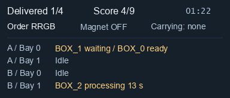

# Webots Logistics PBL Warehouse Challenge

A Webots R2025a project-based learning challenge for teaching mobile robot navigation, finite-state control, task sequencing, and logistics automation with a C++ reference implementation.

The repository provides a simulated warehouse cell with an incoming warehouse, two processing machines, an outgoing warehouse, a mobile robot, four boxes, and a C++ logistics supervisor. The standard student controller is also C++. Box pickup is modeled with asymmetric Webots `Connector` nodes: one active connector on the robot electromagnet and one passive connector on each box's metal plate. Small C and Python student examples are included to show how other languages can interact with the same challenge protocol.

The project is inspired by [RobotAtFactory Lite](https://github.com/P33a/RobotAtFactoryLite).

## Contents

- [Learning Goal](#learning-goal)
- [Requirements](#requirements)
- [Quick Start](#quick-start)
- [Repository Layout](#repository-layout)
- [Student Controller Examples](#student-controller-examples)
- [Challenge Rules](#challenge-rules)
- [Architecture](#architecture)
- [Gripping And Physics](#gripping-and-physics)
- [Student API](#student-api)
- [Adapting The Difficulty](#adapting-the-difficulty)
- [Configuration](#configuration)
- [Troubleshooting](#troubleshooting)
- [License](#license)
- [Author](#author)

## Learning Goal

Students develop a controller that moves boxes through a simplified production flow:

```text
R -> Machine A -> G -> Machine B -> B -> Outgoing
G -> Machine B -> B -> Outgoing
B -> Outgoing
```

The standard C++ controller solves the route for `BOX_0`. A typical assignment asks students to generalize the same state-machine pattern to all four boxes, handle different orders, choose machine bays, and improve the route strategy.

## Requirements

- Webots R2025a
- C++ compiler and GNU Make supported by Webots
- C compiler supported by Webots, only needed for the C example controller
- Python 3 supported by Webots, only needed for the Python example controller
- Windows, Linux, or macOS with a working Webots controller toolchain

The C and C++ controller Makefiles include Webots' standard `resources/Makefile.include`. On Windows, they default `WEBOTS_HOME` to `C:/PROGRA~1/Webots` when the variable is not already set.

## Quick Start

1. Open Webots R2025a.
2. Open `worlds/logistics_pbl_enu.wbt`.
3. Build the active controllers if Webots does not build them automatically:

   ```bash
   cd controllers/logistics_supervisor_cpp
   make
   cd ../student_controller_cpp
   make
   ```

4. Press Play in Webots.
5. Watch the simulation overlay and the controller console output.

The active world uses `logistics_supervisor_cpp` and `student_controller_cpp`.

To try a compact language example, select the `MOBILE_ROBOT` node in Webots and change its `controller` field to `example_student_c` or `example_student_python`. Keep the supervisor as `logistics_supervisor_cpp`.

## Repository Layout

```text
webots_logistics_pbl/
├── controllers/
│   ├── logistics_supervisor_cpp/
│   │   ├── logistics_supervisor_cpp.cpp
│   │   └── Makefile
│   ├── student_controller_cpp/
│   │   ├── student_controller.cpp
│   │   ├── robot_navigation.cpp
│   │   ├── robot_navigation.hpp
│   │   ├── route_planner.hpp
│   │   ├── warehouse_clearance.hpp
│   │   ├── debug_config.hpp
│   │   ├── warehouse_map.hpp
│   │   └── Makefile
│   ├── example_student_c/
│   │   ├── example_student_c.c
│   │   └── Makefile
│   └── example_student_python/
│       └── example_student_python.py
├── docs/
│   └── controller_examples.md
├── worlds/
│   └── logistics_pbl_enu.wbt
├── LICENSE
└── README.md
```

| Path | Purpose |
| --- | --- |
| `worlds/logistics_pbl_enu.wbt` | Main Webots world with the robot, boxes, warehouses, machines, and floor map. |
| `controllers/logistics_supervisor_cpp/` | Active C++ supervisor for orders, box state, scoring, processing, and connector-aware magnet bookkeeping. |
| `controllers/student_controller_cpp/student_controller.cpp` | Standard C++ finite-state controller and main file for student work. |
| `controllers/student_controller_cpp/robot_navigation.*` | C++ navigation, magnet, and supervisor-message API. |
| `controllers/student_controller_cpp/route_planner.hpp` | Selects broad arcs with checked clearance, with corner fillets as a fallback and explicit bay alignment. |
| `controllers/student_controller_cpp/warehouse_clearance.hpp` | Static wall geometry and oriented robot, magnet, and carried-box footprints for arc clearance checks. |
| `controllers/student_controller_cpp/debug_config.hpp` | Console debug level selection for state-only or detailed telemetry output. |
| `controllers/student_controller_cpp/warehouse_map.hpp` | Named robot-center poses for warehouses, machines, clear points, route nodes, and arc setup points. |
| `controllers/example_student_c/` | Small self-contained C example using Webots C devices and the challenge message protocol. |
| `controllers/example_student_python/` | Small Python example using Webots `Robot`, `Motor`, `Emitter`, and `Receiver` APIs directly. |

## Student Controller Examples

Two compact example controllers are included as language references. Each one waits for supervisor `POSE` and `ORDER`, drives to `BOX_0`, picks it, clears the incoming warehouse pocket, and delivers it only if `BOX_0` is already a blue/final part. If the box is red or green, the example stops and reports that a machine route is required.

| Language | Controller name | Main file | What it demonstrates |
| --- | --- | --- | --- |
| C | `example_student_c` | `controllers/example_student_c/example_student_c.c` | Using Webots C API directly: motors, receiver, emitter, pose parsing, and `wb_connector_lock` / `wb_connector_unlock`. |
| Python | `example_student_python` | `controllers/example_student_python/example_student_python.py` | Using Webots Python API directly: `Robot`, wheel `Motor`s, `Receiver.getString()`, `Emitter.send()`, and `Connector.lock()` / `Connector.unlock()`. |

Build the C example from its folder if Webots does not build it automatically:

```bash
cd controllers/example_student_c
make
```

The Python example does not need a Makefile. See [docs/controller_examples.md](docs/controller_examples.md) for a focused examples guide.

## Challenge Rules

The supervisor creates a four-box order. Each box starts in the incoming warehouse as one of three part types:

| Type | Meaning | Required route |
| --- | --- | --- |
| `R` | Raw part | Machine A, then Machine B, then outgoing warehouse |
| `G` | Intermediate part | Machine B, then outgoing warehouse |
| `B` | Final part | Outgoing warehouse |

The supervisor awards one point when a box is accepted by a valid machine input or delivered to the outgoing warehouse. It also controls randomized or manually configured orders, machine delays, output bay readiness, box colors, physics resets, and the simulation overlay.

## Architecture

### Simulation Status Panel

The supervisor's `warehouse_status` Display shows a compact, high-contrast status list. Its normal visible area is **384 × 164 pixels**, about 75% smaller than the previous panel, with 14–16 px status text:

- **Delivered / 4**, **Score**, and elapsed simulation time share the top row. Score includes machine placements and shows the maximum for the initial order (9 for a permutation of `RRGB`).
- **Order** shows the initial box types from left to right (`BOX_0` through `BOX_3`), for example `RRBG`; it stays fixed as boxes are processed. **Magnet** shows the reported ON/OFF state. **Carrying** identifies the box associated with the robot's magnet by the supervisor, or `none` when there is no association.
- Each machine bay has one line: `Idle`, a box with its processing countdown in simulated seconds, a box `ready` to collect, or a `waiting` input alongside the ready output blocking it. `A / Bay 0` means Machine A, bay 0; numbering matches the student API.
- Rejected drops briefly show a red, two-line notice below the list, for up to eight simulated seconds or until the next event. Only then does the visible panel expand to **384 × 208 pixels**; the footer is otherwise transparent.

The title, progress bar, individual box color labels, machine routing reminders, and routine event feed are omitted to keep the scene clear. Task rules and box routes are documented above; detailed activity remains in the controller console.

The panel updates about five times per simulated second, with task events requesting an immediate refresh. Raw ready masks remain available in the API and detailed controller console logs; each bit identifies a box awaiting output collection, not an available input bay.

The timer shows elapsed simulation time and continues while the simulation runs. The standard demo handles only `BOX_0`, so a successful demo ends with `Delivered 1/4` and a score of 1, 2, or 3 for a blue, green, or red starting box, respectively.

The panel is a native Webots Display overlay: drag it to reposition it, use its lower-right resize handle to change its size, or double-click it to open it in a separate window. If it is hidden, select `CHALLENGE_SUPERVISOR` and enable `warehouse_status` under **Robot > Display Devices**. After updating this project, reload the world as well as rebuilding the supervisor so the new Display device is loaded.

The panel drawing code is in `controllers/logistics_supervisor_cpp/warehouse_overlay.hpp`; the supervisor supplies the display state. The preview below uses an illustrative multi-box state rendered from that same drawing code.



### Logistics Supervisor

`controllers/logistics_supervisor_cpp/logistics_supervisor_cpp.cpp` is the active Webots C++ supervisor. It sends task information to the robot controller and receives magnet commands from it. The physical box link is created by the robot-side `Connector`; the supervisor tracks which box is attached so it can score drops and manage machine outputs.

Supervisor messages include:

```text
START
ORDER RRGB
POSE x y theta score attached_box machine_a_ready_mask machine_b_ready_mask
READY A box_index bay_index robot_x robot_y robot_theta
READY B box_index bay_index robot_x robot_y robot_theta
CLEAR A box_index
CLEAR B box_index
```

Students normally do not parse these messages directly in the standard C++ controller. `robot_navigation.cpp` converts them into helper methods on the `Navigation` class. The C and Python examples parse the same messages directly to show how the protocol works.

### Student Controller

`controllers/student_controller_cpp/student_controller.cpp` is a beginner-friendly finite-state machine. It demonstrates how to:

- wait for the robot pose and order;
- pick a box from the incoming warehouse;
- branch based on the box type;
- use machine input, output, approach, and clear poses;
- wait for machine-ready events;
- deliver the processed box to the outgoing warehouse;
- follow aisle curves with `goToArc`, straight sections with `goToLine`, and align with `rotateTo` before entering a bay;
- reverse all the way to a clear pose before starting the next route.

The route planner first builds an aisle route, then considers replacing its turns and straight lead-ins with one broad arc starting at the robot's actual departure position. It checks both turning directions, including the full departure rotation, arc, final alignment, and docking line against the static wall map. Chassis, magnet, and carried box are checked separately, with 15 mm extra clearance for curves and rotations. Only the existing close-fitting, slow docking line uses a 3 mm allowance. The ranking favors fewer movement transitions and less pivoting after a curve. Straight bay-to-bay transfers stay straight.

This allows `rotateTo -> goToArc -> rotateTo` around a machine, or `rotateTo -> goToArc -> rotateTo -> goToLine` when placing a box. The last 10 cm of a shortcut into a bay stay straight, with the existing position and heading tolerances. Arc radii follow the available geometry rather than a fixed 12 cm ceiling; shallow turns can have large radii while remaining entirely within the field.

If no better arc has clearance, the original aisle route remains: it rounds corners with arcs up to 0.12 m, trims at most 40% of adjoining legs, and uses stopped rotations for corners too short for a 0.06 m radius. Lines and tangent arcs hand over in the same simulation tick. The lower-aisle points beneath A remain available as the safe fallback for the blue route.

The clearance model describes the supplied fixed warehouse; it does not detect newly placed obstacles. When changing wall geometry, update `warehouse_clearance.hpp` and run the geometry and physics regressions. The geometry check verifies that all 24 modeled static walls match the world.

Movement functions are non-blocking. Call them every simulation tick until they return `true`, then transition to the next state.

```cpp
case ROUTE_TO_OUTGOING:
  if (nav->goToPose(MAP_OUT_DROP[0].x, MAP_OUT_DROP[0].y, MAP_OUT_DROP[0].theta))
    changeState(DROP_AT_OUTGOING);
  break;
```

## Gripping And Physics

The project now uses Webots `Connector` nodes for pickup:

- The robot has an active connector named `electromagnet_connector`.
- Each box has a passive connector on the visible metal plate face.
- The robot controller calls `enablePresence`, checks `getPresence`, then calls `lock`.
- On release, the robot controller calls `unlock`.
- The supervisor still receives `MAGNET_ON` and `MAGNET_OFF`, but only for challenge bookkeeping. It no longer moves a carried box every simulation step.

The boxes are still physical Webots objects:

- `Solid` is the object that has a transform in the world and can participate in physics.
- `Shape` is visual geometry. It controls what you see, but not necessarily what collides.
- `boundingObject` is collision geometry. The boxes currently use a `Box` bounding object, so they can collide when physics is allowed to handle them normally.
- `Physics` makes a `Solid` dynamic by giving it mass and physical properties. Without `Physics`, a `Solid` is static.

Because carrying is now handled by a Connector link, the physics engine can keep resolving the box's bounding-object contacts while it is attached. The supervisor still teleports boxes only for non-carrying logistics events: initial reset and machine processing output.

Other possible gripping models:

- `VacuumGripper`: simpler contact-based grabbing, useful if the robot should grab any dynamic solid touching a suction pad.
- Mechanical joint or gripper: more realistic, but more modeling and control work.

For physical gripping, the box should remain a `Solid` with a sensible `boundingObject` and `Physics`.

## Student API

Active C++ student code should include `warehouse_map.hpp`, which also exposes the navigation API:

```cpp
#include "warehouse_map.hpp"
```

Useful API groups:

| Group | Functions |
| --- | --- |
| Lifecycle | `Navigation::init`, `Navigation::step`, `Navigation::stop`, `Navigation::resetActions` |
| Status | `poseValid`, `pose`, `lastOrder`, `score`, `attachedBox`, `normalizeAngle` |
| Movement | `goTo`, `goThrough`, `goToPose`, `goToLine`, `goToArc`, `rotateTo`, `rotateClockwiseTo`, `wait`, `backUp`, `backTo`, `moveArc`, `moveCircle` |
| Magnet/connector | `magnetPick`, `magnetDrop`, `magnetIsOn`; these wrap `Connector::lock` and `Connector::unlock` |
| Machine readiness | `machineAReady`, `machineBReady`, ready bay helpers, and ready pose helpers |
| Map constants | `MAP_IN_PICK`, `MAP_OUT_DROP`, `MAP_MACHINE_A_*`, `MAP_MACHINE_B_*`, route nodes, heading constants, and arc setup points |

The world uses an ENU-style floor plane: `X` points east/right, `Y` points north/up, `Z` is height, and `theta` is the robot yaw around `+Z`.

The supervisor draws map-point circles from `MAP_VISUAL_POINTS` in `warehouse_map.hpp`. When you add a new named `Pose2D`, add it to that list so the point appears visually in Webots on the next reset.

## Adapting The Difficulty

This challenge can be adjusted to different higher-education student levels:

- Keep the provided C++ navigation API for introductory robotics students so they can focus on finite-state logic, sequencing, and debugging.
- Partially hide or simplify `robot_navigation.cpp` so students must implement selected behaviors such as pose control, waypoint following, arc control, or message handling.
- Ask advanced students to tune connector tolerances, compare `Connector` with `VacuumGripper`, or model a mechanical gripper.
- Omit the high-level API for advanced students and ask them to develop navigation, supervisor communication, and control logic from scratch.
- Keep the logistics supervisor in use for all variants unless the assignment explicitly replaces the simulation rules.

Possible extensions include generalizing from one box to all four boxes, selecting machine bays dynamically, adding obstacle-aware graph search, and comparing strategies by final score and execution time.

## Configuration

### Order Mode

The order mode is configured near the top of `controllers/logistics_supervisor_cpp/logistics_supervisor_cpp.cpp`:

```cpp
constexpr int kOrderModeRandom = 0;
constexpr int kOrderModeManual = 1;
constexpr int kTaskOrderMode = kOrderModeRandom;
constexpr const char *kManualOrder = "RRGB";
```

Use random mode for normal exercises and manual mode when testing a specific order.

### Navigation Tuning

Main movement tuning constants are in `controllers/student_controller_cpp/robot_navigation.cpp`, including:

- `kMaxWheelSpeedRadS`
- `kPositionToleranceM`
- `kBackPositionToleranceM`
- `kThroughToleranceM`
- `kAngleToleranceRad`
- `kFinalSlowdownRadiusM`
- `kFinalMaxLinearMS`
- `kThroughMaxLinearMS`
- `kArcLinearSpeedMS`
- `kLineToleranceM` and `kTransitToleranceM`

`goToLine(x, y, theta, stopAtGoal, reverse)` follows the line through the goal with the supplied robot heading; reverse motion keeps that heading while backing out. `goToArc(start, radius, angle, clockwise, stopAtGoal)` tracks the planned circle using position and tangent-heading feedback. `moveArc` and `moveCircle` use the same feedback controller with a measured starting pose. Wheel speeds are scaled together at the world's 16 rad/s motor limit to preserve curvature.

Tune these values conservatively and verify that higher speeds do not cause collisions at machine inputs, machine outputs, or warehouse pockets. Reverse clearance now finishes within 1 cm of its goal instead of stopping 5.5 cm early.

For a repeatable physics regression, run `python tests/navigation/prepare.py red RRGB` (optionally append `1` for the second machine bays), then open the printed temporary world with Webots. Use `GRRB` and `BRRG` for the green and blue routes. The observer checks delivery, reverse clearance, and actual robot/carried-box contacts against static obstacles; it records `evidence.log` and `trajectory.csv` in the temporary `navigation_observer` controller directory and quits with a failing status on contact, timeout, or incorrect score. These tests build isolated copies without changing the main world's order or demo selectors.

Run `python tests/navigation/check_planner.py` for wall-model consistency, circular endpoint geometry, payload clearance, and controller-selection checks. After a physics run, `python tests/navigation/verify_run.py red` (append the bay number when testing bay 1) also verifies the logged pickup, drop, and output-approach poses against 12.5 mm position and 0.065 rad heading limits. The test copy records controller output in `student_controller_cpp/controller.log`.

### Debug Levels

Console verbosity is configured in `controllers/student_controller_cpp/debug_config.hpp`:

| Level | Output |
| --- | --- |
| `DEBUG_OFF` | Startup errors only. |
| `DEBUG_STATE` | State transitions and task milestones. |
| `DEBUG_DETAIL` | Periodic state, route index, target pose, robot pose, commanded speeds, wheel speeds, magnet state, attached box, score, and machine-ready masks. |

Use `DEBUG_DETAIL` when diagnosing unexpected slowdowns. The `action` field shows `goToLine`, `goToArc`, `rotateTo`, or `backTo`; the route index identifies the current planned motion segment. `PLAN` lines report the chosen controllers, arc radii, and sweeps; state transitions include the arrival pose and simulation time.

## Troubleshooting

| Symptom | Likely cause | Fix |
| --- | --- | --- |
| Robot stops at every route point | Corners are too short for arcs, or each movement requests a stop. | Leave space for tangent arcs and use non-stopping line/arc segments in transit; keep explicit alignment for bay entry. |
| Robot cuts a corner and hits a wall | A route corner leaves insufficient clearance for the robot and carried box. | Move the aisle corner farther from the wall and rerun the contact regression; include explicit lower-aisle points beneath machines. |
| Robot turns inside a warehouse pocket or bay | The route is missing a clear/reverse step. | Use `backTo` before turning away from narrow spaces. |
| Box is dropped but not accepted | Wrong box type or invalid drop location. | Check the current box state and target pose. |
| Machine-ready mask stays at `0` | No processed box is waiting at that output. | Confirm that the box was accepted by the correct machine and wait for the ready event. |
| Box does not lock to the robot | The connector origins or connector axes are not close/aligned enough. | Check `electromagnet_connector`, the passive box connector, pickup pose, and connector tolerances. |

## License

This project is licensed under the MIT License. See [LICENSE](LICENSE).

## Author

Created by [@jbneto1](https://github.com/jbneto1), José Lima, and Paulo Costa for a robotics project-based learning activity at the Polytechnic Institute of Braganca.
